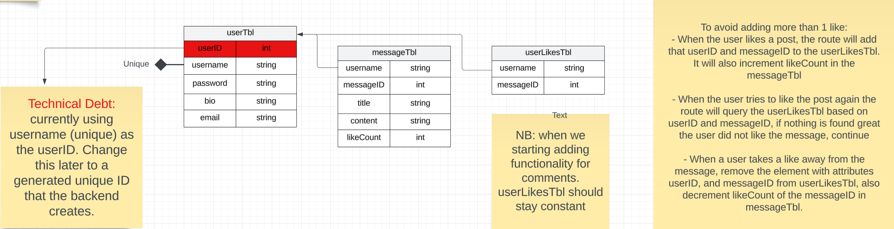

# Back-End Server : README

Current Backend - Evan  

# Documentation:
* Routes:
    * Specify the HTTP method in the description (GET/POST/PUT/DELETE).
    * Specify the parameters in the URL and in the request.body(), so the web knows what to do in their requests.
    * Specify any return values to the web front end in each route.

* Technical Debt:
    * Technical Debt should be structured as "Tech Debt: . . . ".
    * Make sure to document all technical debt.

* Methods: Use Javadoc format for documenting all methods

* Current ERD diagram:


# Deploying to dokku : Tech Debt

* The remote dokku branch is named "team-goku"
* To deploy first go to the backend-dokku branch in origin (BEFORE DOING THIS: Do git remote -a to view the remote branches).
* do "git read-tree backend:backend" in the backend-dokku to get your backend changes into the backend-dokku
* commit that
* push it to origin/backend-dokku

* git push team-goku backend-dokku:master

### To start and stop dokku app:  
```# run on LOCAL host
$ ssh -i ~/.ssh/id_ed25519 -t dokku@dokku.cse.lehigh.edu 'ps:start team-goku'```

```# run on LOCAL host
$ ssh -i ~/.ssh/id_ed25519 -t dokku@dokku.cse.lehigh.edu 'ps:stop team-goku'```