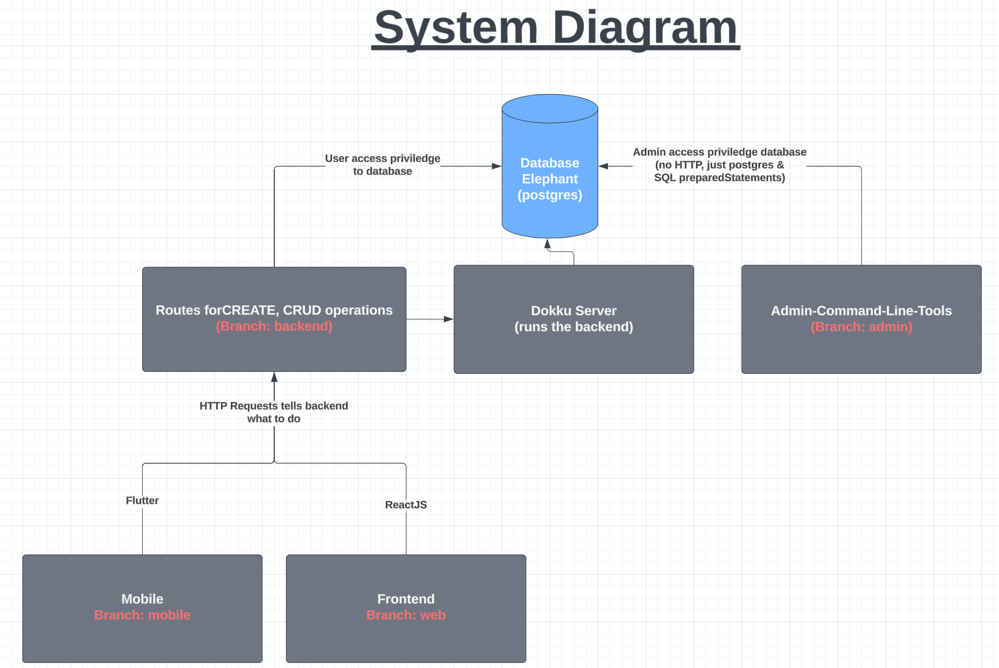
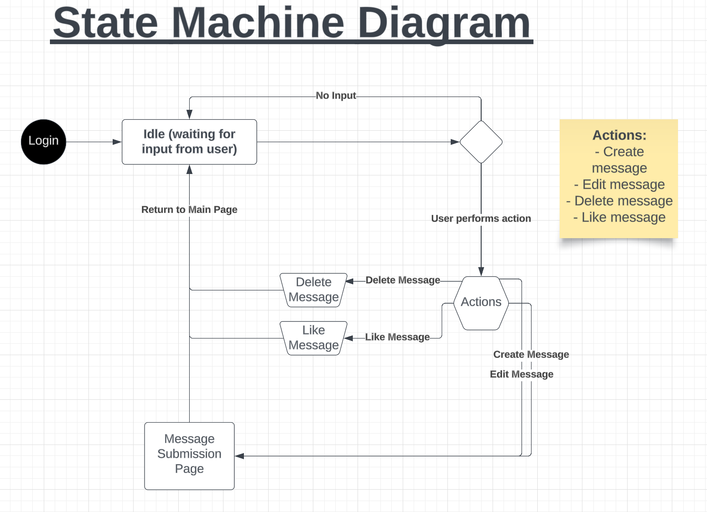
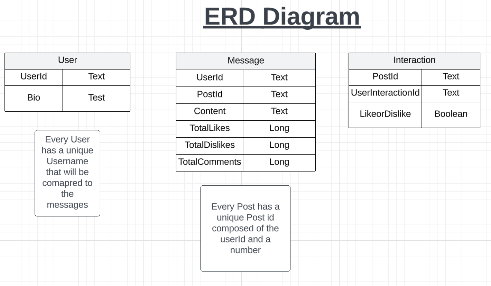

## User Stories for Web and Related Tests

Display Post: As a web user, I want to display messages so I can share ideas.  
Write Message: As a web user, I want to write messages so that my ideas can be posted for others to see.  
Unit test: Test if user can write a message and add to display.  
Automated: Write a test script to verify that messages are displayed correctly. Ex: run comparison between input and displayed output.  
Manual:  
Post several messages using the app interface.  
Reload the page to see if changes stay.  
Verify that messages are visible with no cutoffs.  

Edit Message:  As a web user, I want to edit messages so that I can change what I want others to see.  
Unit Test: test if a user can update an existing post.   
Automated: Write a test script to verify that messages are updated correctly.   
Manual:  
Edit button works and opens the page to the editor.  
Edit the message text in the provided input field and check if changes are saved.

Delete Message: As a web user, I want to delete messages so that I can disregard old ideas.  
Unit test: test if a user can remove a post from the web front page.  
Automated: Write a test script to check if deleted messages are actually deleted..  
Manual:  
Check if the message is still visible after clicking the delete button.  

User Interaction with Message: As a web user, I want to be able to interact with posts so that others know if I agree with their idea.  
Like: As a web user, I want to be able to like posts so that others know I like their ideas.  
Unit Test: Test if a user can like a post.   
Automated:Write a test script to verify that like count corresponds to the number of likes and each account can only like once.   
Manual:  
Click on the "Like" button.  
Observe to see if the like count increases by one and is saved.  
Make sure the user can only hit like once.  
Remove Like: As a web user, I want to be able to remove likes so that I can change my opinion on what ideas I like.  
Unit Test: Test if a user can dislike a post.  
Automated: Write a test script to verify that likes are removed accordingly when removing like.  
Manual:  
1. Click on the "Remove Like" button.
2. Observe to see if the like count decreases by one and is saved.
3. Make sure the user cannot unlike if a like wasn’t given previously.

## Diagrams:

