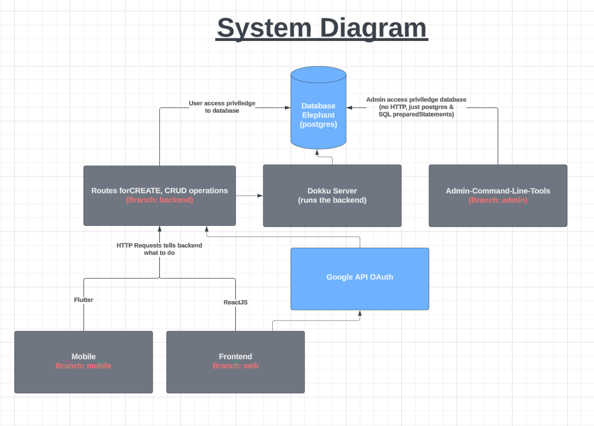
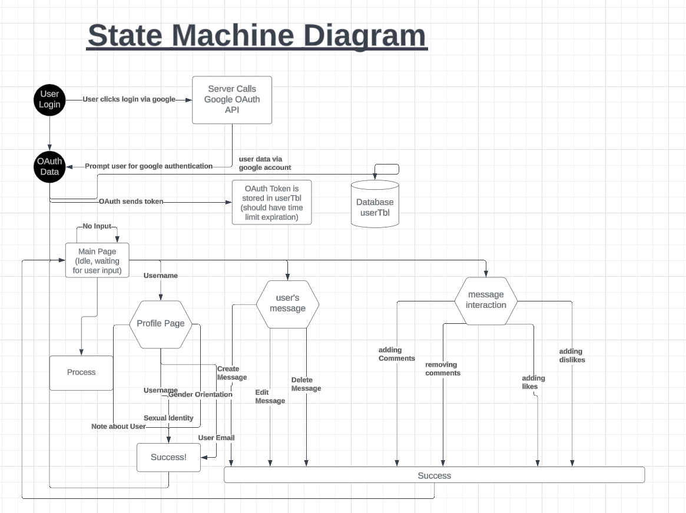
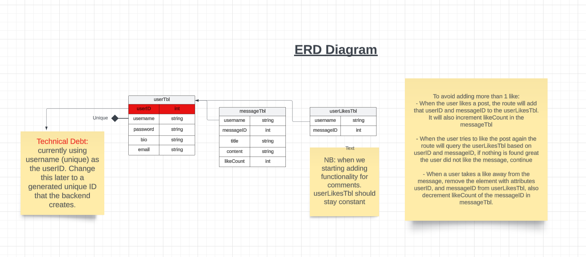
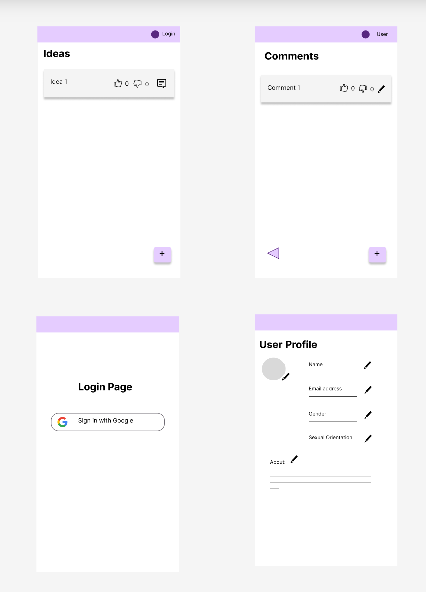

## User Stories for mobile branch and Unit Tests
Mobile Branch
Unit Tests
User upvote and downvote
Unit Test: Test if a user can upvote a post. 
Automated:Write a test script to verify that count corresponds to the number of votes 
Manual: 
Click on the "upvote" button.
Observe to see if the like count increases by one and is saved.
Unit Test: Test if a user can downvote a post. 
Automated:Write a test script to verify that count corresponds to the number of votes. 
Manual: 
1. Click on the "upvote" button.
2. Observe to see if the like count decreases by one and is saved.
Unit Test: Test if each user can only vote once on a post. If a vote is casted twice, the count returns to neutral. 
Automated: Write a test script to verify that votes are removed accordingly when the same user votes twice.
Manual: 
1.Click on the upvote or downvote button.
2. Observe to see if the count returns to neutral when clicked twice.

User profile 
Unit Test: Verifies that the user can update profile information.
Automated: Test script
Manual:	
1. Go to profile page
2. Update information in fields such as name, gender, etc. 
3. Check if new information is saved
Unit Test : Verifies that a user profile is created successfully.
Automated : Write test script. 
Manual:
Create an account 
Ensure account is recognized 

User Login
Unit test: Verify that users can login and logout 
Automated : Write test script. 
Manual:
Login using google credentials

## User Tests
### Instantiation of UserDataRow Object:
Test Description: Ensure UserDataRow object is instantiated successfully.
- Test Steps:
1. Create a new UserDataRow object.
2. Verify that the object is not null.
3. Ensure that all properties of the object are initialized correctly.

### Instantiation of MessageDataRow Object:
Test Description: Ensure MessageDataRow object is instantiated successfully.
- Test Steps:
1. Create a new MessageDataRow object.
2. Verify that the object is not null.
3. Ensure that all properties of the object are initialized correctly.

### Instantiation of UserLikesDataRow Object:
Test Description: Ensure UserLikesDataRow object is instantiated successfully.
- Test Steps:
1. Create a new UserLikesDataRow object.
2. Verify that the object is not null.
3. Ensure that all properties of the object are initialized correctly.

### Instantiation of UserDislikesDataRow Object:
Test Description: Ensure UserDislikesDataRow object is instantiated successfully.
- Test Steps:
1. Create a new UserDislikesDataRow object.
2. Verify that the object is not null.
3. Ensure that all properties of the object are initialized correctly.

### Instantiation of CommentsDataRow Object:
Test Description: Ensure CommentsDataRow object is instantiated successfully.
- Test Steps:
1. Create a new CommentsDataRow object.
2. Verify that the object is not null.
3. Ensure that all properties of the object are initialized correctly.

### Viewing a User:
Test Description: Ensure user data is retrieved successfully.
- Test Steps:
1. Add a user to the system.
2. Retrieve the user's data.
3. Validate that the retrieved data matches the expected user data.

### Adding a User:
Test Description: Ensure a new user is added successfully.
- Test Steps:
1. Add a new user to the system.
2. Retrieve the added user's data.
3. Validate that the added user's data matches the expected data.

### Editing a User:
Test Description: Ensure user data is updated successfully.
- Test Steps:
1. Modify the data of an existing user.
2. Retrieve the user's data.
3. Validate that the retrieved data matches the updated user data.

### Deleting a User:
Test Description: Ensure user is deleted successfully.
- Test Steps:
1. Delete an existing user from the system.
2. Attempt to retrieve the deleted user's data.
3. Validate that the user's data cannot be retrieved.

### Viewing a Message:
Test Description: Ensure message data is retrieved successfully.
- Test Steps:
1. Add a message to the system.
2. Retrieve the message's data.
3. Validate that the retrieved data matches the expected message data.

### Adding a Message:
Test Description: Ensure a new message is added successfully.
- Test Steps:
1. Add a new message to the system.
2. Retrieve the added message's data.
3. Validate that the added message's data matches the expected data.

### Editing a Message:
Test Description: Ensure message data is updated successfully.
- Test Steps:
1. Modify the data of an existing message.
2. Retrieve the message's data.
3. Validate that the retrieved data matches the updated message data.

### Deleting a Message:
Test Description: Ensure message is deleted successfully.
- Test Steps:
1. Delete an existing message from the system.
2. Attempt to retrieve the deleted message's data.
3. Validate that the message's data cannot be retrieved.

### Viewing a Comment:
Test Description: Ensure comment data is retrieved successfully.
- Test Steps:
1. Add a comment to the system.
2. Retrieve the comment's data.
3. Validate that the retrieved data matches the expected comment data.

### Adding a Comment:
Test Description: Ensure a new comment is added successfully.
- Test Steps:
1. Add a new comment to the system.
2. Retrieve the added comment's data.
3. Validate that the added comment's data matches the expected data.

### Editing a Comment:
Test Description: Ensure comment data is updated successfully.
- Test Steps:
1. Modify the data of an existing comment.
2. Retrieve the comment's data.
3. Validate that the retrieved data matches the updated comment data.

### Deleting a Comment:
Test Description: Ensure comment is deleted successfully.
- Test Steps:
1. Delete an existing comment from the system.
2. Attempt to retrieve the deleted comment's data.
3. Validate that the comment's data cannot be retrieved.

### Liking a Message:s
Test Description: Ensure a user can successfully like a message.
- Test Steps:
1. Add a user to the system.
2. Add a message to the system.
3. Allow the user to like the message.
4. Verify that the like is recorded for the message by the user.

### Disliking a Message:
Test Description: Ensure a user can successfully dislike a message.
- Test Steps:
1. Add a user to the system.
2. Add a message to the system.
3. Allow the user to dislike the message.
4.Verify that the dislike is recorded for the message by the user.

