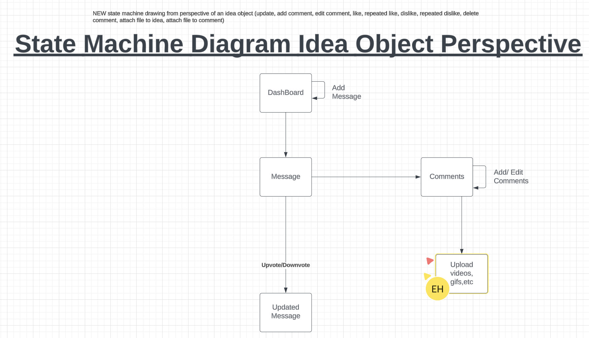
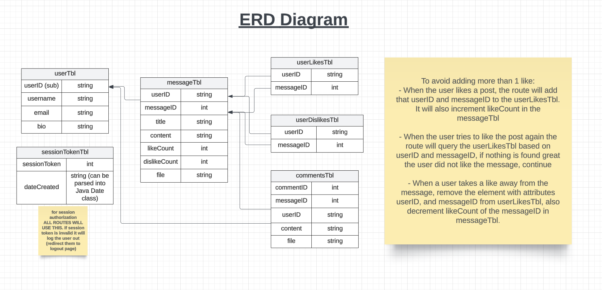

## User Stories for mobile branch and Unit Tests
Mobile Branch
Unit Tests
User upvote and downvote
Unit Test: Test if a user can upvote a post. 
Automated:Write a test script to verify that count corresponds to the number of votes 
Manual: 
Click on the "upvote" button.
Observe to see if the like count increases by one and is saved.
Unit Test: Test if a user can downvote a post. 
Automated:Write a test script to verify that count corresponds to the number of votes. 
Manual: 
1. Click on the "upvote" button.
2. Observe to see if the like count decreases by one and is saved.
Unit Test: Test if each user can only vote once on a post. If a vote is casted twice, the count returns to neutral. 
Automated: Write a test script to verify that votes are removed accordingly when the same user votes twice.
Manual: 
1.Click on the upvote or downvote button.
2. Observe to see if the count returns to neutral when clicked twice.

User profile 
Unit Test: Verifies that the user can update profile information.
Automated: Test script
Manual:	
1. Go to profile page
2. Update information in fields such as name, gender, etc. 
3. Check if new information is saved
Unit Test : Verifies that a user profile is created successfully.
Automated : Write test script. 
Manual:
Create an account 
Ensure account is recognized 

Admin User Stories and Unit Tests
1. As an admin user, I want to manage the content of the App so that things that shouldn’t be available are made invalid to unauthorized users.
   - Unit test: Check that invalidation works within the valid/invalid field. Verify that the unauthorized user is denied access and that the content remains accessible to authorized admin users.

2. As an admin user, I want to view the details of a message or file, including who uploaded it and when it was last updated, to understand its relevance.
   - Unit Test: Check that correct content information is retrieved. Verify that the information displayed matches the actual content details.

3. As an admin user, I want to have a feature to manage storage, allowing me to delete least accessed documents easily.
   - Unit Test: Check that infrequently used uploaded content can be deleted. Confirm that documents marked as least accessed are deleted and that frequently accessed documents remain untouched.

### Team Information:

* Number: 7
* Name: Goku
* Mentor: <Dennis Lam, del225@lehigh.edu>
* Weekly live & synchronous meeting:
    * without mentor: Wednesday 17th, 2 hours
    * with mentor: Monday 15th, 1 hour

### Team Roles:

* Project Manger: <Zander Fahs, zaf326@lehigh.edu>
    * This has changed because it is the start of Phase 3
* Backend developer: <Ivory Le, hhl226@lehigh.edu>
* Admin developer: <Jialin Lin, jil426@lehigh.edu>
* Web developer: <Sam Maloof, sjm225@lehigh.edu>
* Mobile developer: <Evan Hu, exh226@lehigh.edu>

### Essential links for this project:

* Team's Dokku URL(s)
    * <[exh226@dokku.lehigh.edu](https://cse216_sp24_team_09-exh226.dokku.cse.lehigh.edu/)>
* Team's software repo (bitbucket)
    * <https://bitbucket.org/sml3/cse216_sp24_team_09>
* Team's Jira board
    * <https://cse216-24sp-exh226.atlassian.net/jira/software/projects/C2T9/boards/2>

## General questions

1. Did the PM for this week submit this report (If not, why not?)? 
    - Yes, the PM submitted this report
2. Has the team been gathering for a weekly, in-person meeting(s)? If not, why not?
    - Yes.
3. Summarize how well the team met the requirements of this sprint.
    - The team did this moderately well because we were unable to film a full video within the 3 day time span due to time conflicts. However, we worked together to update the ERD and State machine idea object perspective diagram. 
4.  Report on each member's progress (sprint and phase activity completion) – "what is the status?"
    * If incomplete, what challenges are being overcome, how are they being overcome, and by when will the team member be able to finish?
    * If complete, how do you know everyone completed the work, and at a satisfactory level?

    Jialin: Mobile Backlog
        - Need to fetch sessionKey from backend
        - Need to send https requests to save profile information for gender, sexual orientation, and bio sections after routes are set up in the backend.
        - Need to automatically switch screen to profile after login

    Ivory: Web Backlog
        - Need to direct the user back to Dashboard after signing up with Google
        - Need to store user information in the database and update them whenever the user wants
        - Add more comments on web functionalities

    Evan: Backend Backlog
        - Need to make all routes use the checkSessionKey for authorization by valid session
        - Maybe add the userID as part of the session token for authorization by the user
        - Make the documentation more consistent.
        - Have routes have more descriptive return values.
        - Update the database and all methods and routes for gender and sexual orientation

    Zander: Admin Backlog
        - Need to have unit tests to check if the user can properly pre populate the tables with test data, invalidate an idea, and invalidate a user
5. Summary of "code review" during which each team member discussed and showed their progress – "how did you confirm the status?"
    - We confirmed the status during the code review by seeing if the code passed our unit tests for the sprint.
    - The mobile end demonstrated their progress by launching Flutter, showing us the progress, and going through the unit tests
    - The web end demonstrated their progress by launching their web front-end, showing us the progress, and going through their unit tests
    - The backend demonstrated their unit tests and functionality using postman
    - Admin demonstrated functionality through the unit testing by looking at the elephantSQL

6. What did you do to encourage the team to be working on phase activities "sooner rather than later"?
    - I encouraged through slack and we met twice within the 3 day sprint. 
    - We also consistently messaged through imessages

7. What did you do to encourage the team to help one another?
    - We consistently asked each other questions if we were stuck, and I encouraged certain members to communicate their personal progress, regardless of if they know they answer. Some feedback is better than none. 

8. How well is the team communicating?
    - There is often small bickering between team members, but we still move forwards. To be more productive, I tell them to communicate whether or not they have their work done, or if they are struggling because others are able to ehlp with the issues. 

9. Discuss expectations the team has set for one another, if any. Please highlight any changes from last week.
    - We have set the expectation that we should communicate our issues so we can help each other and further the progress of the project.
    - We also have meetings twice a week to discuss progress and issues. 

10. If anything was especially challenging or unclear, please make sure this is [1] itemized, [2] briefly described, [3] its status reported (resolved or unresolved), and [4] includes critical steps taken to find resolution.
    * Challenge: Merge conflict 
        * Status: unresolved
        * Description: There is a problem with the web that has led to over 400 merge conflicts.
        * Critical steps taken to find resolution:
            * Identified that it was due to not having the right things in the .gitignore. 
            * solution was to deny the merge request and have them retry after fixing the gitignore. 

## Project Management
Self-evaluation of PM performance

0. When did your team meet with your mentor, and for how long?
    - during monday recitation for about an hour.

1. Describe your use of Jira.  Did you have too much detail?  Too little?  Just enough? Did you implement policies around its use (if so, what were they?)?
    * I had too little detail, it could use more details of what exactly needed to be completed and when. I did not implement any policies around its use.

2. How did you conduct team meetings?  How did your team interact outside of these meetings?
    - I conducted team meetings in person in FML for a few hours and we discussed what steps we needed to take next. Since this was the switch off phase, we were telling each other how to work with our previous ends. Outside of these meetings we interact well and are friendly towards each other. 

3. What techniques (daily check-ins/scrums, team programming, timelines, Jira use, slack use, group design exercises) did you use to mitigate risk? Highlight any changes from last week.
    - We used Jira board to mitigate risk and lable the risk levels of each of the assignements. 

4. Describe any difficulties you faced in managing the interactions among your teammates. Were there any team issues that arose? If not, what do you believe is keeping thins so constructive?
    - There were no issues between any individuals. We just had an issue with merge conflicts that we were working together to resolve. 

5. What is your biggest concern as you think ahead to the next sprint?
    - My biggest concern for the next sprint is getting all of ends to pass their tests. 

6. Describe the most significant obstacle or difficulty your team faced.
    - Our most significant obstacle this is sprint was time. We did not have enough time in our schedules to film one video together. 

7. What might you suggest the team or the next PM "start", "stop", or "continue" doing in the next sprint?
    - I would suggest that the next PM make good use of the Jira board to keep the team on task. 

8. How well did you estimate time during the early part of the sprint? How did your time estimates change as the sprint progressed?
    - I underestimated how short this sprint was and was initially overwhelmed. However, I have a better grasp on the time it will take to complete each task. 

9. What aspects of the project would cause concern for your customer right now, if any?
    - There are no aspects of the project that would cause concern for the customer at the moment. 

User Login
Unit test: Verify that users can login and logout 
Automated : Write test script. 
Manual:
Login using google credentials

## User Tests
### Instantiation of UserDataRow Object:
Test Description: Ensure UserDataRow object is instantiated successfully.
- Test Steps:
1. Create a new UserDataRow object.
2. Verify that the object is not null.
3. Ensure that all properties of the object are initialized correctly.

### Instantiation of MessageDataRow Object:
Test Description: Ensure MessageDataRow object is instantiated successfully.
- Test Steps:
1. Create a new MessageDataRow object.
2. Verify that the object is not null.
3. Ensure that all properties of the object are initialized correctly.

### Instantiation of UserLikesDataRow Object:
Test Description: Ensure UserLikesDataRow object is instantiated successfully.
- Test Steps:
1. Create a new UserLikesDataRow object.
2. Verify that the object is not null.
3. Ensure that all properties of the object are initialized correctly.

### Instantiation of UserDislikesDataRow Object:
Test Description: Ensure UserDislikesDataRow object is instantiated successfully.
- Test Steps:
1. Create a new UserDislikesDataRow object.
2. Verify that the object is not null.
3. Ensure that all properties of the object are initialized correctly.

### Instantiation of CommentsDataRow Object:
Test Description: Ensure CommentsDataRow object is instantiated successfully.
- Test Steps:
1. Create a new CommentsDataRow object.
2. Verify that the object is not null.
3. Ensure that all properties of the object are initialized correctly.

### Viewing a User:
Test Description: Ensure user data is retrieved successfully.
- Test Steps:
1. Add a user to the system.
2. Retrieve the user's data.
3. Validate that the retrieved data matches the expected user data.

### Adding a User:
Test Description: Ensure a new user is added successfully.
- Test Steps:
1. Add a new user to the system.
2. Retrieve the added user's data.
3. Validate that the added user's data matches the expected data.

### Editing a User:
Test Description: Ensure user data is updated successfully.
- Test Steps:
1. Modify the data of an existing user.
2. Retrieve the user's data.
3. Validate that the retrieved data matches the updated user data.

### Deleting a User:
Test Description: Ensure user is deleted successfully.
- Test Steps:
1. Delete an existing user from the system.
2. Attempt to retrieve the deleted user's data.
3. Validate that the user's data cannot be retrieved.

### Viewing a Message:
Test Description: Ensure message data is retrieved successfully.
- Test Steps:
1. Add a message to the system.
2. Retrieve the message's data.
3. Validate that the retrieved data matches the expected message data.

### Adding a Message:
Test Description: Ensure a new message is added successfully.
- Test Steps:
1. Add a new message to the system.
2. Retrieve the added message's data.
3. Validate that the added message's data matches the expected data.

### Editing a Message:
Test Description: Ensure message data is updated successfully.
- Test Steps:
1. Modify the data of an existing message.
2. Retrieve the message's data.
3. Validate that the retrieved data matches the updated message data.

### Deleting a Message:
Test Description: Ensure message is deleted successfully.
- Test Steps:
1. Delete an existing message from the system.
2. Attempt to retrieve the deleted message's data.
3. Validate that the message's data cannot be retrieved.

### Viewing a Comment:
Test Description: Ensure comment data is retrieved successfully.
- Test Steps:
1. Add a comment to the system.
2. Retrieve the comment's data.
3. Validate that the retrieved data matches the expected comment data.

### Adding a Comment:
Test Description: Ensure a new comment is added successfully.
- Test Steps:
1. Add a new comment to the system.
2. Retrieve the added comment's data.
3. Validate that the added comment's data matches the expected data.

### Editing a Comment:
Test Description: Ensure comment data is updated successfully.
- Test Steps:
1. Modify the data of an existing comment.
2. Retrieve the comment's data.
3. Validate that the retrieved data matches the updated comment data.

### Deleting a Comment:
Test Description: Ensure comment is deleted successfully.
- Test Steps:
1. Delete an existing comment from the system.
2. Attempt to retrieve the deleted comment's data.
3. Validate that the comment's data cannot be retrieved.

### Liking a Message:s
Test Description: Ensure a user can successfully like a message.
- Test Steps:
1. Add a user to the system.
2. Add a message to the system.
3. Allow the user to like the message.
4. Verify that the like is recorded for the message by the user.

### Disliking a Message:
Test Description: Ensure a user can successfully dislike a message.
- Test Steps:
1. Add a user to the system.
2. Add a message to the system.
3. Allow the user to dislike the message.
4.Verify that the dislike is recorded for the message by the user.