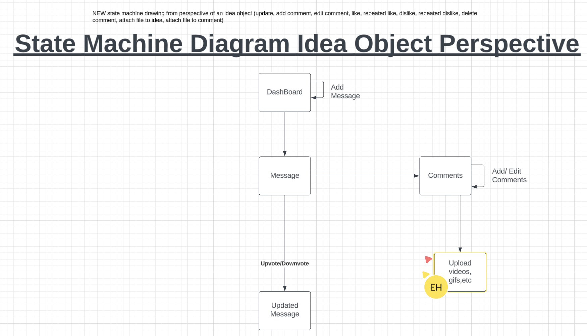
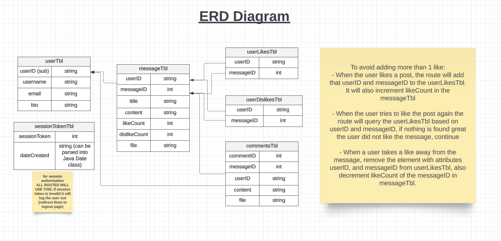

## User Stories for mobile branch and Unit Tests
Mobile Branch
Unit Tests
User upvote and downvote
Unit Test: Test if a user can upvote a post. 
Automated:Write a test script to verify that count corresponds to the number of votes 
Manual: 
Click on the "upvote" button.
Observe to see if the like count increases by one and is saved.
Unit Test: Test if a user can downvote a post. 
Automated:Write a test script to verify that count corresponds to the number of votes. 
Manual: 
1. Click on the "upvote" button.
2. Observe to see if the like count decreases by one and is saved.
Unit Test: Test if each user can only vote once on a post. If a vote is casted twice, the count returns to neutral. 
Automated: Write a test script to verify that votes are removed accordingly when the same user votes twice.
Manual: 
1.Click on the upvote or downvote button.
2. Observe to see if the count returns to neutral when clicked twice.

User profile 
Unit Test: Verifies that the user can update profile information.
Automated: Test script
Manual:	
1. Go to profile page
2. Update information in fields such as name, gender, etc. 
3. Check if new information is saved
Unit Test : Verifies that a user profile is created successfully.
Automated : Write test script. 
Manual:
Create an account 
Ensure account is recognized 

Admin User Stories and Unit Tests
1. As an admin user, I want to manage the content of the App so that things that shouldn’t be available are made invalid to unauthorized users.
   - Unit test: Check that invalidation works within the valid/invalid field. Verify that the unauthorized user is denied access and that the content remains accessible to authorized admin users.

2. As an admin user, I want to view the details of a message or file, including who uploaded it and when it was last updated, to understand its relevance.
   - Unit Test: Check that correct content information is retrieved. Verify that the information displayed matches the actual content details.

3. As an admin user, I want to have a feature to manage storage, allowing me to delete least accessed documents easily.
   - Unit Test: Check that infrequently used uploaded content can be deleted. Confirm that documents marked as least accessed are deleted and that frequently accessed documents remain untouched.

## Backlog

    Evan (Mobile):
- Get oauth to work so that i can use the google drive scope.
-> also after oauth works switch from devsession to mobile login route to get the session key
    -> cache the session key
- figure out what is going wrong with converting images to base64.
  Then, pass that string in the add message request
- test link parsing and make sure that works

    Sam (Web):
- logging in
- being able to post images

    

### Team Information:

* Number: 7
* Name: Goku
* Mentor: <Dennis Lam, del225@lehigh.edu>
* Weekly live & synchronous meeting:
    * without mentor: Wednesday 24th, 2 hours
    * with mentor: Monday 29th, 3 hour

### Team Roles:

* Project Manger: <Zander Fahs, zaf326@lehigh.edu>
* Backend developer: <Ivory Le, hhl226@lehigh.edu>
* Admin developer: <Jialin Lin, jil426@lehigh.edu>
* Web developer: <Sam Maloof, sjm225@lehigh.edu>
* Mobile developer: <Evan Hu, exh226@lehigh.edu>

### Essential links for this project:

* Team's Dokku URL(s)
    * <[exh226@dokku.lehigh.edu](https://cse216_sp24_team_09-exh226.dokku.cse.lehigh.edu/)>
* Team's software repo (bitbucket)
    * <https://bitbucket.org/sml3/cse216_sp24_team_09>
* Team's Jira board
    * <https://cse216-24sp-exh226.atlassian.net/jira/software/projects/C2T9/boards/2>

## General questions

1. Did the PM for this week submit this report (If not, why not?)? 
    - Yes, the PM submitted this report
2. Has the team been gathering for a weekly, in-person meeting(s)? If not, why not?
    - Yes.
3. Summarize how well the team met the requirements of this sprint.
    - This sprint the team met the requirements well. 
4.  Report on each member's progress (sprint and phase activity completion) – "what is the status?"
    * If incomplete, what challenges are being overcome, how are they being overcome, and by when will the team member be able to finish?
    * If complete, how do you know everyone completed the work, and at a satisfactory level?

    Jialin: Admin
    - 
    Ivory: Backend
    - 
    Evan: Mobile
    - 
    Sam: Web 
    - 
5. Summary of "code review" during which each team member discussed and showed their progress – "how did you confirm the status?"
    - We confirmed the status during the code review by seeing if the code passed our unit tests for the sprint.
    - The mobile end demonstrated their progress by launching Flutter, showing us the progress, and going through the unit tests
    - The web end demonstrated their progress by launching their web front-end, showing us the progress, and going through their unit tests
    - The backend demonstrated their unit tests and functionality using postman
    - Admin demonstrated functionality through the unit testing by looking at the elephantSQL

6. What did you do to encourage the team to be working on phase activities "sooner rather than later"?
    - I encouraged through slack and text messages. Making sure that there was communication between the branches, especially those that are were connected. (Web->backend<-mobile) 
    - We also consistently messaged through imessages

7. What did you do to encourage the team to help one another?
    - We consistently asked each other questions if we were stuck, and I encouraged certain members to communicate their personal progress, regardless of if they know the answer. Some feedback is better than none. 

8. How well is the team communicating?
    - There is often small bickering between team members, but we still move forwards. To be more productive, I tell them to communicate whether or not they have their work done, or if they are struggling because others are able to help with the issues. 

9. Discuss expectations the team has set for one another, if any. Please highlight any changes from last week.
    - We have set the expectation that we should communicate our issues so we can help each other and further the progress of the project.
    - We also have meetings twice a week to discuss progress and issues. In addition to this, we communicate through slack and text messages.

10. If anything was especially challenging or unclear, please make sure this is [1] itemized, [2] briefly described, [3] its status reported (resolved or unresolved), and [4] includes critical steps taken to find resolution.
    * Challenge: Merge conflict 
        * Status: unresolved
        * Description: There is a problem with the web that has led to over 400 merge conflicts.
        * Critical steps taken to find resolution:
            * Identified that it was due to not having the right things in the .gitignore. 
            * solution was to deny the merge request and have them retry after fixing the gitignore. 

11. What might you suggest the team or the next PM "start", "stop", or "continue" doing in the next sprint?
    * I would suggest that we meet in person more frequently to make faster progress on work. It is harder when meeting on zoom because you can only show one screen at a time. 

### Back-end

1. Overall evaluation of back-end development (how was the process? was Jira used appropriately? how were tasks created? how was completion of tasks verified?)
    - The backend development went well, the Jira was used appropriately and the tasks were created based on the rubric. 
2. List your back-end's REST API endpoints
    - GET /userprofile/:userID
        - Description: Retrieves the user profile data for a specific user identified by userID.
        - Response: Returns user profile data in JSON format.
    - PUT /userprofile/:userID
        - Description: Updates the user profile for a specific user identified by userID.
        - Request Body: Contains updated user profile data (newUsername, newEmail, newBio) in JSON format.
        - Response: Returns a success or error message in JSON format.
    - DELETE /userprofile/:userID
        - Description: Deletes the user profile for a specific user identified by userID.
        - Response: Returns a success message in JSON format.
    - GET /messages
        - Description: Retrieves all messages from the message table.
        - Response: Returns a list of messages in JSON format.
    - GET /messages/msgsByUser/:userID
        - Description: Retrieves all messages associated with a specific user identified by userID.
        - Response: Returns a list of messages in JSON format.
    - GET /messages/:messageID
        - Description: Retrieves a specific message identified by messageID.
        - Response: Returns message details in JSON format.
    - POST /messages
        - Description: Adds a new message to the message table along with an optional file attachment.
        - Request Body: Contains message data (userID, title, content) and an optional file attachment.
        - Response: Returns a success or error message in JSON format.
    - PUT /messages/:messageID/like
        - Description: Allows a user to like or unlike a specific message.
        - Request Body: Contains the session token and user ID.
        - Response: Returns a success message indicating whether the like was added or removed.
    - PUT /messages/:messageID/dislike
        - Description: Allows a user to dislike or undislike a specific message.
        - Request Body: Contains the session token and user ID.
        - Response: Returns a success message indicating whether the dislike was added or removed.
    - GET /comment/:commentID
        - Description: Retrieves a specific comment identified by commentID.
        - Request Parameter: commentID (an int for the comment id).
        - Response: Returns the comment details in JSON format.
    - GET /comments/:messageID
        - Description: Retrieves all comments associated with a specific message identified by messageID.
        - Request Parameter: messageID (an int for the message id).
        - Response: Returns a list of comments in JSON format.
    - POST /comments/:messageID
        - Description: Adds a new comment to a specific message identified by messageID.
        - Request Body: Contains the session token, user ID, and comment content.
        - Response: Returns a success message indicating that the comment was added.
    - PUT /comments/:commentID
        - Description: Edits a specific comment identified by commentID.
        - Request Body: Contains the session token and new content for the comment.
        - Response: Returns a success message indicating that the comment was edited.
    - DELETE /comments/:commentID
        - Description: Deletes a specific comment identified by commentID.
        - Request Body: Contains the session token.
        - Response: Returns a success message indicating that the comment was deleted.

3. Assess the quality of the back-end code
    - Code Readability
        - code is readable and easy to understand
    - Maintainability
        - there is modularization, the code is well organized. There is also separation of concern between the different components of the code.
4. Describe the code review process you employed for the back-end
    - Posted to dokku to check for functionality in the back-end 
    - checked to see if the requirements in the rubirc and jira board were met.
5. What was the biggest issue that came up in code review of the back-end server?
    - Needed to post to dokku to check for backend functionality. 
6. Is the back-end code appropriately organized into files / classes / packages?
    - yes, it is appropriately organized.
7. Are the dependencies in the `pom.xml` file appropriate? Were there any unexpected dependencies added to the program?
    - The appropriate dependencies were added
        - <dependency>
            <groupId>com.google.api-client</groupId>
            <artifactId>google-api-client</artifactId>
            <version>2.0.0</version>
        </dependency>
        <!-- Google OAuth Client for Jetty -->
        <dependency>
            <groupId>com.google.oauth-client</groupId>
            <artifactId>google-oauth-client-jetty</artifactId>
            <version>1.34.1</version>
        </dependency>
        <!-- Google Drive API -->
        <dependency>
            <groupId>com.google.apis</groupId>
            <artifactId>google-api-services-drive</artifactId>
            <version>v3-rev20220815-2.0.0</version>
        </dependency>
        <!-- https://mvnrepository.com/artifact/com.google.auth/google-auth-library-oauth2-http -->
        <dependency>
            <groupId>com.google.auth</groupId>
            <artifactId>google-auth-library-oauth2-http</artifactId>
            <version>0.3.1</version>
        </dependency>
8. Evaluate the quality of the unit tests for the back-end
    - the unit tests for the back-end properly served their functions
9. Describe any technical debt you see in the back-end
    - no technical debt 

### Admin

1. Overall evaluation of admin app development (how was the process? was Jira used appropriately? how were tasks created? how was completion of tasks verified?)
    - The tasks were created based off of the sprint 12 rubric and we kept track of them through jira board
2. Describe the tables created by the admin app
    - commentstbl
        - holds the comments for messages
    - userDislikesTbl
        - when a user dislikes a message
    - userLikesTbl
        - when a user likes a message
    - messageTbl
        - holds the messages of posts
    - userTbl
        - holds the list of users
    - sessionTokenTbl
        - holds the session token
3. Assess the quality of the admin code
    - Modularity
    - comments
    - sectioning of ideas
    - well organized
4. Describe the code review process you employed for the admin app
    - Used mvn exec to test the functionality of the code
5. What was the biggest issue that came up in code review of the admin app?
    - Coming up with unit tests
6. Is the admin app code appropriately organized into files / classes / packages?
    - yes, it is appropriately organized into the correct sections.
7. Are the dependencies in the `pom.xml` file appropriate? Were there any unexpected dependencies added to the program?
    - The appropriate dependencies were in the pom.xml and none were added during this sprint. 
8. Evaluate the quality of the unit tests for the admin app
    - the admin the user tests include checking the elaphantSQL and running mvn exec
9. Describe any technical debt you see in the admin app
    - deleting least accessed files

### Web

1. Overall evaluation of Web development (how was the process? was Jira used appropriately? how were tasks created? how was completion of tasks verified?)
    - Issue swith testing, 404 issues with posting
    - created buttons for uploading links and images
    - displaying images
2. Describe the different models and other templates used to provide the web front-end's user interface
    - drew models of mock web front-end
    - Used lucid chart to show how the different parts of the web connect
3. Assess the quality of the Web front-end code
    - Organized, divided into different pages
    - could use more comments
4. Describe the code review process you employed for the Web front-end
    - tested for functionality
    - tested for visuals (does it look like the mock web fron-end?)
5. What was the biggest issue that came up in code review of the Web front-end?
    - logging in (Oauth)
        - keeps getting a 404 error
        - 500 Internal server error
    - trouble posting
        - 500 internal server error

6. Is the Web front-end code appropriately organized into files / classes / packages?
    - yes, it is appropriately organized. 
7. Are the dependencies in the `package.json` file appropriate? Were there any unexpected dependencies added to the program?
    - No dependencies were added to the program. 
8. Evaluate the quality of the unit tests for the Web front-end
    - The unit tests are functioning correctly.
9. Describe any technical debt you see in the Web front-end
    - logging in and posting aren't working
    - the functionality of the program isn't working
### Mobile

1. Overall evaluation of Mobile development (how was the process? was Jira used appropriately? how were tasks created? how was completion of tasks verified?)
    - The mobile has a bit of debt and is struggling with the functionality portion of the sprint.
2. Describe the activities that comprise the Mobile app
    - getting an image from camer, gallery, parsing test into message, and caching
3. Assess the quality of the Mobile code
    - the code is readable, but not very maintainable. There is a separation of concerns though.
4. Describe the code review process you employed for the Mobile front-end
    - Went over the unit tests and compared the mobile front-end to our mock mobile display. 
    - We tested for the functionality requirements, listed in the rubric for the sprint and on Jira board.
5. What was the biggest issue that came up in code review of the Mobile front-end?
    - Getting the API to properly function.
6. Is the Mobile front-end code appropriately organized into files / classes / packages?
    - Yes, it is appropriately organized.
7. Are the dependencies in the `pubspec.yaml` (or build.gradle) file appropriate? Were there any unexpected dependencies added to the program?
    - Added image plug-in, convert plug-in, and url launcher plug-in.
    - The dependencies are appropriate
8. Evaluate the quality of the unit tests for the Mobile front-end here
    - The unit tests are functional and 
9. Describe any technical debt you see in the Mobile front-end here
    - need to get oauth to work to ue the google drive scope
    - cache the session key
    - convert images to base64 and pass that string in the add message request
    - test link parsing

## Project Management
Self-evaluation of PM performance

1. When did your team meet with your mentor, and for how long?
    - during monday recitation for about an hour.

2. Describe your use of Jira.  Did you have too much detail?  Too little?  Just enough? Did you implement policies around its use (if so, what were they?)?
    * It had too little detail, it could use more details of what exactly needed to be completed and when. I did not implement any policies around its use.

3. How did you conduct team meetings?  How did your team interact outside of these meetings?
    - I conducted team meetings in person in FML for a few hours and we discussed what steps we needed to take next. Since this was the switch off phase, we were telling each other how to work with our previous ends. Outside of these meetings we interact well and are friendly towards each other. 

4. What techniques (daily check-ins/scrums, team programming, timelines, Jira use, slack use, group design exercises) did you use to mitigate risk? Highlight any changes from last week.
    - We used Jira board to mitigate risk and lable the risk levels of each of the assignements. 

5. Describe any difficulties you faced in managing the interactions among your teammates. Were there any team issues that arose? If not, what do you believe is keeping thins so constructive?
    - There were no issues between any individuals. We just had an issue with merge conflicts that we were working together to resolve. 

6. Describe the most significant obstacle or difficulty your team faced.
    - Our most significant obstacle this is sprint was time. We did not have enough time in our schedules to film one video together. 

7. What is your biggest concern as you think ahead to the next sprint?
    - My biggest concern for the next sprint is getting all of ends to pass their tests. 

8. How well did you estimate time during the early part of the sprint? How did your time estimates change as the sprint progressed?
    - I underestimated how short this sprint was and was initially overwhelmed. However, I have a better grasp on the time it will take to complete each task. 

9. What aspects of the project would cause concern for your customer right now, if any?
    - There are no aspects of the project that would cause concern for the customer at the moment. 

User Login
Unit test: Verify that users can login and logout 
Automated : Write test script. 
Manual:
Login using google credentials

## User Tests
### Instantiation of UserDataRow Object:
Test Description: Ensure UserDataRow object is instantiated successfully.
- Test Steps:
1. Create a new UserDataRow object.
2. Verify that the object is not null.
3. Ensure that all properties of the object are initialized correctly.

### Instantiation of MessageDataRow Object:
Test Description: Ensure MessageDataRow object is instantiated successfully.
- Test Steps:
1. Create a new MessageDataRow object.
2. Verify that the object is not null.
3. Ensure that all properties of the object are initialized correctly.

### Instantiation of UserLikesDataRow Object:
Test Description: Ensure UserLikesDataRow object is instantiated successfully.
- Test Steps:
1. Create a new UserLikesDataRow object.
2. Verify that the object is not null.
3. Ensure that all properties of the object are initialized correctly.

### Instantiation of UserDislikesDataRow Object:
Test Description: Ensure UserDislikesDataRow object is instantiated successfully.
- Test Steps:
1. Create a new UserDislikesDataRow object.
2. Verify that the object is not null.
3. Ensure that all properties of the object are initialized correctly.

### Instantiation of CommentsDataRow Object:
Test Description: Ensure CommentsDataRow object is instantiated successfully.
- Test Steps:
1. Create a new CommentsDataRow object.
2. Verify that the object is not null.
3. Ensure that all properties of the object are initialized correctly.

### Viewing a User:
Test Description: Ensure user data is retrieved successfully.
- Test Steps:
1. Add a user to the system.
2. Retrieve the user's data.
3. Validate that the retrieved data matches the expected user data.

### Adding a User:
Test Description: Ensure a new user is added successfully.
- Test Steps:
1. Add a new user to the system.
2. Retrieve the added user's data.
3. Validate that the added user's data matches the expected data.

### Editing a User:
Test Description: Ensure user data is updated successfully.
- Test Steps:
1. Modify the data of an existing user.
2. Retrieve the user's data.
3. Validate that the retrieved data matches the updated user data.

### Deleting a User:
Test Description: Ensure user is deleted successfully.
- Test Steps:
1. Delete an existing user from the system.
2. Attempt to retrieve the deleted user's data.
3. Validate that the user's data cannot be retrieved.

### Viewing a Message:
Test Description: Ensure message data is retrieved successfully.
- Test Steps:
1. Add a message to the system.
2. Retrieve the message's data.
3. Validate that the retrieved data matches the expected message data.

### Adding a Message:
Test Description: Ensure a new message is added successfully.
- Test Steps:
1. Add a new message to the system.
2. Retrieve the added message's data.
3. Validate that the added message's data matches the expected data.

### Editing a Message:
Test Description: Ensure message data is updated successfully.
- Test Steps:
1. Modify the data of an existing message.
2. Retrieve the message's data.
3. Validate that the retrieved data matches the updated message data.

### Deleting a Message:
Test Description: Ensure message is deleted successfully.
- Test Steps:
1. Delete an existing message from the system.
2. Attempt to retrieve the deleted message's data.
3. Validate that the message's data cannot be retrieved.

### Viewing a Comment:
Test Description: Ensure comment data is retrieved successfully.
- Test Steps:
1. Add a comment to the system.
2. Retrieve the comment's data.
3. Validate that the retrieved data matches the expected comment data.

### Adding a Comment:
Test Description: Ensure a new comment is added successfully.
- Test Steps:
1. Add a new comment to the system.
2. Retrieve the added comment's data.
3. Validate that the added comment's data matches the expected data.

### Editing a Comment:
Test Description: Ensure comment data is updated successfully.
- Test Steps:
1. Modify the data of an existing comment.
2. Retrieve the comment's data.
3. Validate that the retrieved data matches the updated comment data.

### Deleting a Comment:
Test Description: Ensure comment is deleted successfully.
- Test Steps:
1. Delete an existing comment from the system.
2. Attempt to retrieve the deleted comment's data.
3. Validate that the comment's data cannot be retrieved.

### Liking a Message:s
Test Description: Ensure a user can successfully like a message.
- Test Steps:
1. Add a user to the system.
2. Add a message to the system.
3. Allow the user to like the message.
4. Verify that the like is recorded for the message by the user.

### Disliking a Message:
Test Description: Ensure a user can successfully dislike a message.
- Test Steps:
1. Add a user to the system.
2. Add a message to the system.
3. Allow the user to dislike the message.
4.Verify that the dislike is recorded for the message by the user.